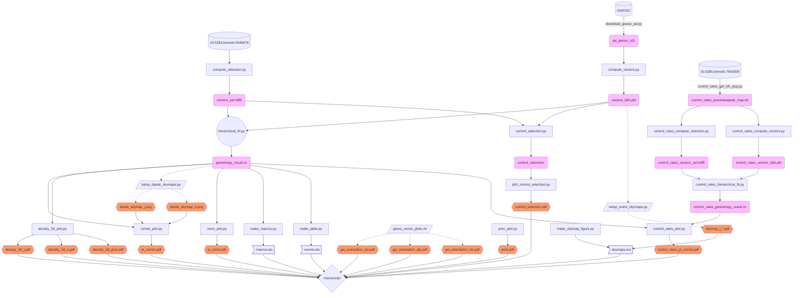

# Software

This directory contains the files to reproduce the analysis in _The Directional Isotropy of LIGO-Virgo binaries_ (Isi+2023), 
from data publicly avaliable in Zenodo: parameter estimation data releases from [GWOSC](https://www.gw-openscience.org) and LIGO-Virgo selection function
injections [10.5281/zenodo.5546676](https://doi.org/10.5281/zenodo.5546676); intermediate data products produced in our analysis are cached in
[10.5281/zenodo.7775266](https://doi.org/10.5281/zenodo.7775266).

When compiling the manuscript, _showyourwork_ will automatically use cached data products to speed of the computation (see instructions below).

## Code guide

Every quantitative element in the paper can be traced back to a piece of code through the [_snakemake_](https://snakemake.readthedocs.io/en/stable/) workflow defined by the [`showyourwork.yml`](https://github.com/maxisi/gwisotropy/blob/main/showyourwork.yml) and [`Snakemake`](https://github.com/maxisi/gwisotropy/blob/main/Snakamake) files located in the root directory of this repository---see below for a visual representation of the Directed Acyclic Graph (DAG) encoding this workflow.
The code is mainly written in Python, and the core computations happen inside the `utils/` packge described below.

The relation between all these different pieces of software and data is as follows:



In this diagram, figures are represented in _orange_; datasets produced by this code as _pink_ and scripts in `light blue`. Datasets downloaded from zenodo are represtented by their DOI and a "database" symbol; tex files and scripts also have characterisitc shapes.

The key executables to perform the analyses in the paper are:
- `hierarchical_fit.py`: main script carrying out the hierarchical Bayesian fit to LIGO-Virgo data shown in Figs. 2-4, whose result is cached to `gwisotropy_result.nc`; to run, it requires outputs from the following scripts (our, equivalently, their cached data products):
  - `compute_selection.py`: loads LIGO-Virgo selection injections from [10.5281/zenodo.5546676](https://doi.org/10.5281/zenodo.5546676) and computes the corresponding $\vec{N}$ and $\vec{J}$ vectors, whose Cartesian compnents are cached to `vectors_sel.hdf5` (6 numbers per injection).
  - `compute_vectors.py`: loads LIGO-Virgo samples for real detections obtained from [GWOSC](https://www.gw-openscience.org) and computes the corresponding $\vec{N}$ and $\vec{J}$ vectors, whose Cartesian compnents are cached to `vectors_bbh.pkl` (6 numbers per sample per event).
- `control_selection.py`: similar to `hierarchical_fit.py` but recursively carries out fits to an increasing number of synthetic draws from the injection selection set to produce the result in Fig. 5; the result of each fit is saved to a directory called `control_selection/`; it also requires `vectors_sel.hdf5` and `vectors_bbh.pkl` as input.
- `control_rates_hierarchical_fit.py`: carries out the the fit to LIGO-Virgo data as in `hierarchical_fit.py`, but this time based on measurements reweighted to a different mass and spin model, to produce the resultin Fig. 6; it depends on output from the following scripts:
  - `control_rates_compute_selection.py`: similar to `compute_selection.py` but reweighting to a different astro population; outputs `control_rates_vectors_sel.hdf5`.
  - `control_rates_compute_vectors.py`: similar to `compute_vectors.py` but reweighting to a different astro population; outputs `control_rates_vectors_bbh.pkl`.
 
The results produced by the above three scripts are fed into plotting scripts that produce the figures in the paper:
- _Figure 1_: `gwiso_vector_plots.nb` the only Mathematica notebook, creates the diagrams in Fig. 1.
- _Figure 2:_ `corner_plot.py` plots corner plot in Fig. 2; requires `gwisotropy_result.nc`, with an additional preprocessing step:
  - `setup_dipole_skymaps.py` makes the skymaps shown in the inset of Fig. 2.
- _Figure 3:_ `density_3d_plot.py` makes the 3D density plots in Fig. 3, loads `gwisotropy_result.nc` directly.
- _Figure 4:_ `norm_plot.py` plots the posteriors and prior for the $\vec{N}$ and $\vec{J}$ measurements, shown in Fig. 4, depends only on `gwisotropy_result.nc`.
- _Figure 5_: `plot_control_selection.py` creates the corner plot for all fits in Fig.5, reading in fits from `control_selection/`.
- _Figure 6_: `control_rates_plot.py` plots the result in Fig. 6 based on `control_rates_gwisotropy_result.nc` and `gwisotropy_result.nc`.
- _Figure 7_: `prior_plot.py`
- _Figure 8_: `make_skymap_figure.py` collates skymap plots for all events created using [`ligo.skymap`](https://pypi.org/project/ligo.skymap/) by L. Singer et al (see `setup_event_skymaps.py`)

Finally, two scripts collate information to make tables and macros for the paper:
- `make_macros.py`
- `make_table.py`

### Utilities

The scripts rely on a small Python package provided in the [`utils`](utils) directory, which contains its own documentation.

The utilities are split up over a number of files in `utils/` with the following purposes (key elements in bold):
- **`infernce.py`**: defines the statistical models used for sampling the hierarchical posterior using [PyMC](http://pymc.io)
- `plots.py`: contains lightweight plot settings
- **`pops.py`**: contains utilities for reweighting samples to different populations
- `prior.py`: containts a single function to draw vectors from our hierarchical prior
- `settings.py`: containts settings for hierarchical analysis and reweighting
- **`transf.py`**: contains code required to compute Cartesian components for $\vec{N}$ and $\vec{J}$ starting from LIGO-Virgo samples

See inside each file for docstrings documenting usage.

## Installation

The environment requirements to execute these scripts are specified in the [`environment.yml`](https://github.com/maxisi/gwisotropy/blob/main/environment.yml) in the source directory; if not using `showyourwork`, this can be used to create a compatible Conda environment by doing, e.g.,

```
conda env create -f environment.yml
```

As of Nov 2023, you might need a custom backwards-compatible version of _showyourwork_ for this to work hosted [here](https://github.com/maxisi/showyourwork/tree/gwisotropy). You can install it through `pip` by doing:

```
pip install -U git+https://github.com/maxisi/showyourwork.git@gwisotropy
```

You can then simply build the article by calling the following from within the rootdir of this repository:

```
showyourwork build
```


Some intermediate data products are generated in the process and cached by
_showyourwork_ to speed up computation and skip some intermediate steps. The cached data products will be automatically downloaded from [10.5281/zenodo.7775266](https://doi.org/10.5281/zenodo.7775266) when using _showyourwork_.
