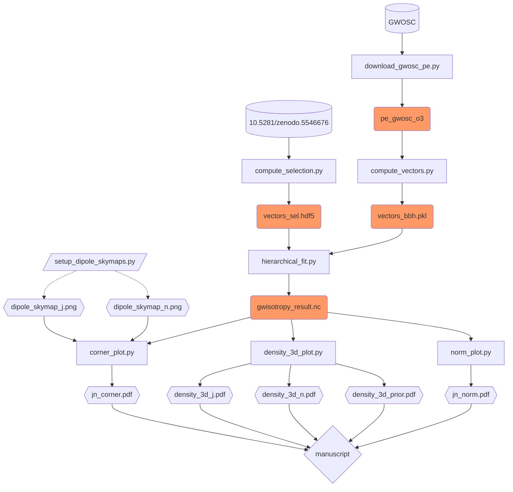

# Software

## Plotting scripts

This directory contains the files to reproduce the analysis in _The Directional Isotropy of LIGO-Virgo binaries_ (Isi+2023), 
from data publicly avaliable in Zenodo: parameter estimation data releases from [GWOSC](https://www.gw-openscience.org) and LIGO-Virgo selection function
injections [10.5281/zenodo.5546676](https://doi.org/10.5281/zenodo.5546676); intermediate data products produced in our analysis are cached in
[10.5281/zenodo.7775266](https://doi.org/10.5281/zenodo.7775266).

When compiling the manuscript, _showyourwork_ will automatically use cached data products to speed of the computation.

The relation between the different pieces of software and data is as follows:



The environment requirements to execute these scripts are specified in the [`environment.yml`](https://github.com/maxisi/gwisotropy/blob/main/environment.yml) in the source directory; if not using `showyourwork`, this can be used to create a compatible Conda environment by doing, e.g.,

```
conda env create -f environment.yml
```

Some intermediate data products are generated in the process and cached by
_showyourwork_ to speed up computation and skip some intermediate steps.
